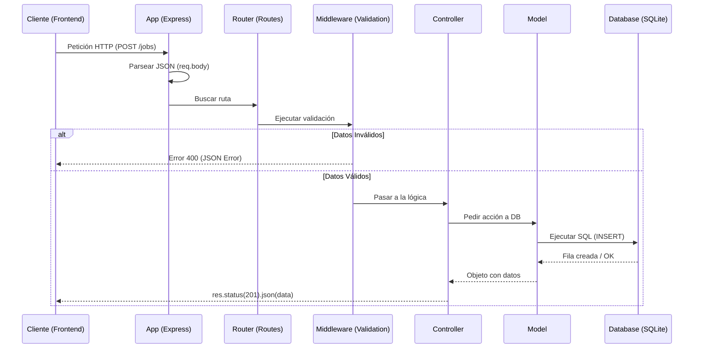

# Flujo de Ejecución: Código vs Analogía

Este documento detalla qué sucede cuando el servidor arranca y cuando recibe una petición, separando la implementación técnica de la analogía conceptual.

---

## 🏛️ PARTE 1: La Realidad (El Código)

### Fase A: Arranque (Boot)

1.  **Gatillo:** `npm run dev` ejecuta el punto de entrada `src/app.ts`.
2.  **Carga de Módulos:** Se resuelven los imports en cadena: `app` → `routes` → `middlewares` → `controllers` → `schemas` → `models` → `db`.
3.  **Configuración de DB (`database.ts`):**
    - Se instancia `better-sqlite3` apuntando a `jobs.db`.
    - Se ejecutan PRAGMAs: `journal_mode = WAL` (rendimiento) y `foreign_keys = ON` (integridad).
4.  **Middleware & Rutas:** `app.ts` registra los middlewares globales y delega las rutas al `jobsRouter`.
5.  **Escucha:** Se ejecuta `app.listen()`, abriendo el puerto 3000 para tráfico TCP/HTTP.

### Fase B: Ciclo de Vida de una Petición (Request)

1.  **Entrada:** Un cliente envía un paquete HTTP al puerto 3000.
2.  **Procesamiento Inicial:** El `express.json()` parsea el body y `cors()` añade las cabeceras de seguridad.
3.  **Enrutado:** El objeto `req` viaja por el Router hasta encontrar el endpoint (Ej: `POST /jobs`).
4.  **Capa de Validación:** Antes de llegar al controlador, el middleware `validateCreateJob/UpdateJob` (`middlewares/validation.ts`) ejecuta `schema.safeParse(body)` usando los esquemas de **Zod** (`schemas/job.ts`). Si hay error, se corta la ejecución con un 400.
5.  **Delegación:** El `JobController` recibe la petición, extrae los parámetros y llama al método correspondiente del `JobModel`.
6.  **Lógica de Datos & SQL:**
    - El `JobModel` construye el query SQL.
    - Si es una mutación (POST/PATCH), se encapsula en una `db.transaction()` para asegurar atomicidad.
7.  **Acción en Disco:** `better-sqlite3` lee o escribe físicamente en el fichero `.db`.
8.  **Mapeo (Data Transformation):** El modelo transforma las filas crudas (rows) en objetos de la interfaz `Job`, aplicando lógica como `.split(',')` para las tecnologías.
9.  **Respuesta Final:** El controlador recibe los datos y usa `res.json()` para finalizar el ciclo.

#### 📊 Visualización del Flujo (Request/Response)

---

## 🏰 PARTE 2: La Analogía (El Búnker de Datos)

En esta historia, nuestro backend es un búnker de alta seguridad encargado de gestionar archivos laborales.

1.  **El Despertar (Boot):** Antes de abrir, se despierta a los especialistas. Todos llevan su **Manual de Protocolo (TypeScript)** para evitar errores. El vigilante de la **Llave** abre la **Caja Fuerte (jobs.db)** en el **Sótano (Disco)**, activa la **Bitácora Rápida (WAL)** y pone los **Seguros de Integridad (FK)**. Por último, se desbloquea la **Puerta 3000 (Puerto)**.
2.  **El Peticionario (La Request):** Desde el exterior llega un **Peticionario** y se presenta ante la **Puerta 3000**. Trae un mensaje o un sobre con datos en la mano. Él es quien va a recorrer el búnker.
3.  **La Aduana (Middlewares):** Justo al cruzar el umbral, un guardia revisa al peticionario: que no traiga veneno (**CORS**) y que su sobre sea de un material estándar (**JSON**).
4.  **Los Pasillos (Router):** El peticionario camina por pasillos llenos de carteles. "Asuntos de empleo, por aquí". Esto evita que los visitantes deambulen por zonas restringidas.
5.  **El Inspector de Planos (Zod):** Antes de entrar a ningún despacho, un oficial detiene al peticionario y compara su solicitud con el **Plano Maestro (Schema)**. Si ha olvidado un campo, el peticionario es expulsado del búnker por una salida de emergencia.
6.  **El Oficial de Enlace (Controller):** Al final del pasillo, un administrativo recibe al peticionario en su ventanilla. Coge su sobre, traduce sus deseos y llama por teléfono al experto.
7.  **El Archivero (Model):** El experto que habla el dialecto antiguo (**SQL**). Para cambios importantes, firma un **Contrato de Todo o Nada (Transacción)**: o se actualizan todos los libros o no se anota nada.
8.  **La Búsqueda:** El Archivero baja al sótano (es la parte más lenta). Saca fichas sucias del estante de hierro de la caja fuerte.
9.  **El Informe (Mapping):** El Archivero limpia las fichas, las traduce a lenguaje humano (JSON) y las entrega al Oficial.
10. **El Tubo de Aire (Response):** El Oficial de Enlace pone el sello de "Misión Cumplida" al informe y lo lanza por un tubo de aire hacia el cliente, mientras el peticionario sale del edificio.

---

## 📓 DICCIONARIO: Realidad ↔ Analogía

| Concepto Técnico       | Personaje/Elemento      | Función                                                           |
| :--------------------- | :---------------------- | :---------------------------------------------------------------- |
| **Petición (Request)** | El Peticionario         | El actor principal que viaja por el búnker con la información.    |
| **TypeScript**         | Manual de Protocolo     | Garantiza que todos hablen el mismo lenguaje técnico.             |
| **Puerto 3000**        | Puerta 3000             | El portal de entrada específico por el que llega el peticionario. |
| **Middlewares**        | Aduana / Guardia        | Filtros de seguridad y formato justo en la entrada.               |
| **Router**             | Pasillos / Carteles     | Dirige al peticionario al departamento correcto.                  |
| **Zod / Schemas**      | Inspector de Planos     | Valida que los papeles del peticionario sean correctos.           |
| **Controller**         | Oficial de Enlace       | Orquestador: recibe al peticionario en su ventanilla.             |
| **Model**              | El Archivero            | El único con acceso y conocimiento para hablar con la DB.         |
| **SQL**                | Dialecto Antiguo        | El lenguaje que entiende la base de datos.                        |
| **Transacción**        | Contrato de Todo o Nada | Asegura que múltiples cambios ocurran como uno solo.              |
| **Disco Duro / I/O**   | El Sótano               | El lugar físico lento donde se guarda la información.             |
| **better-sqlite3**     | La Búsqueda             | La acción de entrar y salir de la caja fuerte.                    |
| **JSON**               | Informe / Papel Oficial | Formato estructurado y limpio de salida de datos.                 |
